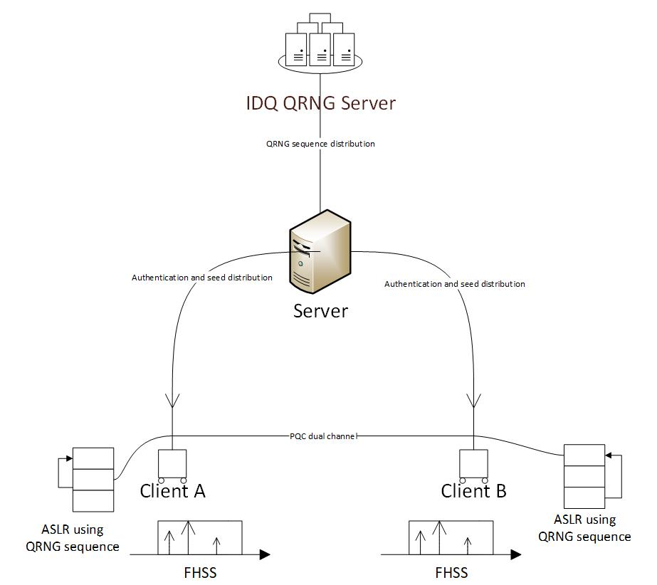

# FLIQ | CMU x ID Quantique Randomness Challenge

## Quantum-Generated Random Sequence for Frequency Hopping and ASLR Proof-of-Concept - Dockerized Architecture

## Project Overview

This project consists of two distinct components: a frequency hopping application and a separate proof-of-concept
demonstrating potential ASLR mitigation techniques. Both components leverage a Quantum Random Number Generator
(QRNG) from IDQuantique as a source of entropy. The entire system is deployed using Docker containers to mimic a
real-world distributed environment.

**Component 1: Frequency Hopping Application**

* **`frequency_hopping_app.py`:** A Tkinter-based GUI application that simulates frequency hopping. It utilizes a
sequence of random numbers generated by the IDQuantique QRNG to determine the hopping frequencies. This
application runs within a Docker container.

**Component 2: ASLR Proof-of-Concept**

* **`aslr_1.py`:** A separate proof-of-concept demonstrating potential ASLR mitigation techniques. This component
is intended for potential use in a client-side application that communicates with a Frequency Hopping Spread
Spectrum (FHSS) system. It runs within a Docker container.
* **Enhanced Seed Management:**  Robust seed management practices, including periodic seed rotation of seed derivation keys.

**Architecture:**

* **`server.py`:** This script acts as the central server and runs within a dedicated Docker container. It is
responsible for authenticating client requests and providing a unique seed from the IDQ QRNG API to each
authenticated client.
* **`client.py`:** This script represents a client application and runs within two separate Docker containers.
These containers are deployed within isolated Docker networks to simulate a real-world distributed environment.
Each client container receives a unique seed from the `server.py` container and uses this seed for both ASLR
mitigation and FHSS key generation.

## Dependencies

* **Python 3.x**
* **Tkinter** 
* **Requests:** For interacting with the IDQ QRNG API. `pip install requests`
* **IDQuantique QRNG API Key:** You're required to have an API key from IDQuantique to access their QRNG service.
* **Docker:** Required for running the containerized application.

## Setup

1. **Obtain an IDQuantique QRNG API Key:** Register for an account with IDQuantique and obtain an API key.
2. **Install Docker:** Ensure Docker is installed and running on your system.
3. **Configure API Key:** You're required to set the `IDQUANTIQUE_API_KEY` environment variable within each Docker
container. This can be done during container creation or through Docker Compose.

## Further Development

To enhance the security and flexibility of this architecture, we plan to implement the following improvements:

* **Post-Quantum Cryptography (PQC) Key Exchange:** Clients will securely exchange keys using a Post-Quantum
Cryptography algorithm, such as Kyber, after receiving their initial seed from the server. This will establish a
secure, long-term communication channel.
* **Dual-Channel Communication:**  The current system utilizes a single sequence derived from the initial seed for
FHSS. We aim to implement a dual-channel communication system. One channel will continue to use the initial seed
for FHSS, while the second channel, secured by the PQC-derived keys, will be used for additional data transmission
or control signals. This provides redundancy and increased bandwidth.
* **Client Authentication Improvements:** Explore more advanced client authentication methods beyond the current
system.
